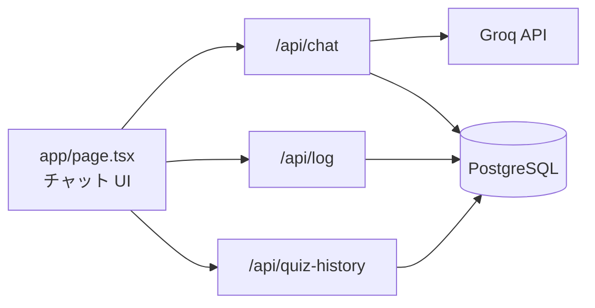

# ai-study-support

中学レベルの英単語クイズと英語チャット。Groq で問題生成・会話し、回答は PostgreSQL に保存します。

## 使い方

チャット画面の入力欄にコマンドを打ちます。


| コマンド    | 内容                                 |
| ------- | ---------------------------------- |
| `/quiz` | 英単語クイズ 5 問（Groq で出題。失敗時は DB の固定問題） |
| `/db`   | 英単語クイズ 5 問（DB の問題のみ）               |
| `/chat` | 通常の英語チャットに戻る                       |


クイズ中は日本語で答えを入力します。5 問終了後に正答数が表示されます。

Groq が使えないときは、チャットは定型文の応答になり、画面上部に通知が出ます。クイズは DB フォールバックで続行できます。

## はじめに（リポジトリを pull したあと）

1. [Groq Console](https://console.groq.com/keys) で API キーを発行する
2. ルートに `.env` を用意する（`cp .env.example .env`）し、`**GROQ_API_KEY**` を設定する
3. [Docker Desktop](https://www.docker.com/products/docker-desktop/) を起動し、リポジトリ直下で次を実行する

```bash
docker compose up
```

初回は依存関係のインストール・DB マイグレーション・シードのあと開発サーバーが立ち上がります。ログに `Ready` と出たら [http://localhost:3000](http://localhost:3000) を開きます。

止めるときは `Ctrl+C`、または `docker compose down`（DB データはボリュームに残ります）。

## アプリの構成




| レイヤ | パス                              | 役割                                      |
| --- | ------------------------------- | --------------------------------------- |
| UI  | `app/page.tsx`                  | チャット・クイズの画面、`/quiz` `/db` `/chat` の切り替え |
| API | `app/api/chat/route.ts`         | チャット・クイズ出題（Groq → 失敗時 DB）               |
| API | `app/api/log/route.ts`          | クイズの回答を `QuizLog` に保存                   |
| API | `app/api/quiz-history/route.ts` | 過去の出題履歴の取得                              |
| LLM | `lib/llm/groq.ts`               | Groq Chat Completions クライアント            |
| クイズ | `lib/quiz/fallback.ts`          | 応答 JSON のパース、DB からの問題抽選                 |
| DB  | `lib/prisma.ts`                 | Prisma クライアント                           |
| DB  | `prisma/schema.prisma`          | `QuizLog`（回答ログ）、`QuizQuestion`（固定問題バンク） |


**スタック**: Next.js 14（App Router）、Tailwind CSS v4、Prisma、PostgreSQL、Groq（既定モデル `llama-3.1-8b-instant`）

**Docker**: `docker-compose.yml` で Postgres 16 と Next 開発サーバーを起動。`app` コンテナ内の `DATABASE_URL` は Compose 側で Postgres に向けます。